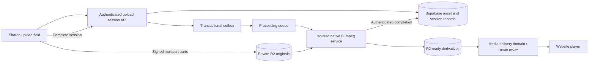

# Video submission and delivery design

Verification for the accompanying shared fixes: `pnpm safety:review` passed all
12 steps on 7 September 2026, including 423 test files / 3,724 tests and 21
trial database checks. Focused conversion, upload, creation and existing editing
suites also passed. Reports: `tmp/safety-gate/latest-review.md`,
`tmp/safety-gate/latest-review.json`, and
`tmp/safety-gate/latest-review-blockers.txt`. Development preflight does not
prove production R2 connectivity or real-device media compatibility. The
architectural High-priority gaps below remain unresolved until the proposed
backend is built.

Date: 7 September 2026. Scope: Market, Business, Tourism & Events, including
editing existing posts.

## Decision

Use direct, resumable uploads into a **private R2 ingestion bucket**, then
native FFmpeg in an isolated background processing service. Publish only
validated, normalized MP4 and poster derivatives. Keep one 720p rendition
initially; add adaptive delivery only when playback measurements justify its
extra storage and operational cost.

R2 stores and delivers objects; it does not automatically transcode them.
Cloudflare Stream is the managed alternative when avoiding operation of an
encoder is more valuable than retaining an R2-only video system. Stream provides
upload, encoding and adaptive delivery; its resumable tus uploads are especially
suitable for mobile connections. See
[Cloudflare media architecture](https://developers.cloudflare.com/use-cases/media-streaming/)
and
[Stream resumable uploads](https://developers.cloudflare.com/stream/uploading-videos/resumable-uploads/).

**Delivery status:** This change implements shared browser-path bug fixes and
completes the proposed backend/product design. The new ingestion bucket,
multipart APIs, processing service, database model and asynchronous form flow
below are specifications, not deployed or implemented features. Existing uploads
still depend on browser conversion for MOV.

## Existing flow and findings

All three creation pages prewarm `video-fast-upload.ts`, which calls
`compress-before-upload.ts` and `video-compressor.ts`. Category helpers also
supply the validated server upload fallback. Editing uses those shared upload
helpers. The separate `use-media-upload.ts` hook calls the same compressor with
its own timeout/proxy orchestration.

1. Select an MP4, WebM or MOV, at most 50 MiB per file.
2. Read browser video metadata and optionally run single-thread FFmpeg WASM,
   loaded from unpkg.
3. Give conversion 60 seconds on the shared posting path. MOV must become MP4;
   compatible MIME types may fall back to the original.
4. Request `/api/media/upload-url`, PUT to R2, then call
   `/api/media/upload-complete`. On failure, try `/api/media/upload`.
5. Completion checks ownership, expected size, container magic bytes, and the
   existing malware heuristic; it records `validated_at`. Post attachment
   confirmation requires validated media.
6. Playback already supports byte ranges in `/api/media/serve/[...key]`; card
   players use posters, lazy loading and shared playback coordination. Preserve
   these useful behaviors.

| Priority | Finding                                                                                                                                                        | Disposition                                                                                                                                                                                        |
| -------- | -------------------------------------------------------------------------------------------------------------------------------------------------------------- | -------------------------------------------------------------------------------------------------------------------------------------------------------------------------------------------------- |
| High     | MOV conversion is a blocking phone operation. A 60-second deadline, WASM loading, memory pressure or decoding/encoding errors can prevent submission entirely. | Replace with background processing in the design. Screenshot confirms this error path, but does not establish which underlying failure occurred; original video and device logs were not provided. |
| High     | MIME/container checks do not establish H.264/AAC, decoded validity, duration, HDR handling, or cross-browser playback. Even MP4 can contain HEVC.              | Native probing and verified derivatives before ready state. Do not weaken validation by merely renaming MOV.                                                                                       |
| High     | Direct-upload completion buffers the entire R2 object before checking actual size. Signed PUT URLs do not enforce the claimed byte size.                       | HEAD plus bounded streaming validation in the processing service; quarantine and quotas. Existing memory behavior remains a gap.                                                                   |
| Medium   | Encoder failures could leave a WASM worker alive; exit codes and empty output were not checked.                                                                | Fixed in shared compressor, with regression tests.                                                                                                                                                 |
| Medium   | The purported 720p bounds allowed 1280×1280; frame rate and pixel format were not fixed.                                                                       | Fixed: long/short edge bounds, 30 fps, yuv420p, explicit video/optional audio selection and metadata removal. HDR tone mapping still requires the future processor.                                |
| Medium   | A lost PUT response could trigger a duplicate server upload even when completion verification succeeded.                                                       | Fixed: return the verified uploaded URL.                                                                                                                                                           |
| Medium   | Required-compatible output rejected only QuickTime, not other unsupported MIME types.                                                                          | Fixed: allow only the accepted output container types. This is not codec validation.                                                                                                               |
| Medium   | Concurrent prewarming can launch multiple costly conversions; leaving/backgrounding a phone tab interrupts work.                                               | Future upload queue and server processing remove this dependency.                                                                                                                                  |
| Medium   | Retaining an original when conversion grows it can retain an incompatible codec or non-faststart MP4.                                                          | Future ready outputs must satisfy a measured media contract, independent of filename or relative size.                                                                                             |
| Medium   | A presigned PUT can be reused until expiry; validating a publicly served writable key risks later replacement.                                                 | Private source objects and separate processor-only derivative keys. Never serve originals.                                                                                                         |

## One submission experience across all categories

Use one `VideoUploadField` backed by one upload-session client, with category
policy supplied by the server. The following names describe the proposed
component, not an existing export.

| Category         | Existing integration                                                                  | Proposed behavior                                                                                                                                                                       |
| ---------------- | ------------------------------------------------------------------------------------- | --------------------------------------------------------------------------------------------------------------------------------------------------------------------------------------- |
| Market           | `listing-media-upload.ts`, `listing_video` area                                       | Product clip(s) constrained by existing plan entitlement; first ready asset drives the card preview. Use ordered asset references even where current UI offers one slot.                |
| Business         | `business-media-upload.ts`, cover video in `business_cover`                           | Promo video and its poster attach to the profile. Keep the existing ready promo while processing a replacement.                                                                         |
| Tourism & Events | `promotion-media-upload.ts`; tourism business and event paths within `create-tourism` | Ordered video collection subject to existing entitlements; each clip has independent upload/processing/retry status. Preserve business versus promotion ownership and moderation rules. |

Keep current plan counts and the 50 MiB input cap for initial rollout. Suggested
initial processing duration cap: 120 seconds per clip, enforced after probing;
this is a proposed product policy, not an existing restriction. A later 250 MiB
phone-original tier should be introduced only after encoder capacity and abuse
quotas are measured, with coordinated UI/API policy changes.

The form shows a filename, poster or placeholder, bytes uploaded, and one of:
Waiting, Uploading (percentage), Processing, Ready, Retry needed. Do not invent
a processing percentage; show an indeterminate indicator until the service
provides real progress. Include Remove and Retry on the affected file, and
accessible live status announcements. Error messages distinguish connection
loss, unsupported media, policy limits, processing failure and expired upload
sessions.

After bytes reach R2, allow the post to be saved with processing asset IDs.
Explain: “Your post is saved. The video will appear when processing finishes.”
Public pages show an image/poster until the video is ready and moderation allows
publication. If a particular paid placement requires a ready video, save as
draft and explain the pending requirement. Do not discard other successfully
uploaded fields on retry.

Uploads resume after connection loss while the source File is available. Across
page reloads, persist only session metadata and confirmed part numbers; require
the user to reselect the matching file unless durable file access is available.
Verify name, size, lastModified and a fingerprint before reusing parts. Never
promise automatic recovery of a lost browser File. Processing continues after
the browser closes.

## Storage and processing architecture

Use a separate container/VM service with pinned native FFmpeg and ffprobe,
bounded CPU, RAM and temporary disk; do not execute long encodes inside the
Next.js request handler. Processing workers fetch only server-derived R2 keys,
run with network/protocol restrictions, and use argument arrays rather than
shell interpolation. Do not pass user-supplied media URLs to ffmpeg. Sandbox
malformed input processing and keep the image updated.

New tables:

- `video_assets`: UUID, owner_id, category, state, source_key, source_etag,
  source_bytes, duration_ms, width, height, video_codec, audio_codec,
  color_transfer, output_key, poster_key, output_bytes, encoder_version,
  error_code, attempts, lease_until, created_at, ready_at, deleted_at.
- `video_upload_sessions`: UUID, asset_id, R2 multipart upload ID, source key,
  expected bytes, expiry, completed_at; unique active session policy per asset.
- `video_asset_links`: asset_id, category, entity_id, role, position; server
  validates actual category entity ownership. Unique role/position constraints
  where appropriate; enforce entitlements transactionally on attachment,
  counting pending and ready assets.
- `video_processing_outbox`: asset_id, source_etag, encoder_version,
  dispatched_at; unique processing identity. Insert with queued state in one DB
  transaction. A reconciler dispatches unsent rows so DB/queue partial failures
  cannot strand uploads.

Asset states: uploading → queued → processing → ready; processing → failed; any
nondeleted state → deleted. Expired sessions are marked expired and aborted.
Claim jobs using a lease; duplicate queue delivery returns the existing ready
result or waits for the active lease. Retry transient failures at most three
times with backoff; reject corrupt/over-limit inputs without repeated encoding.
Move exhausted jobs to a dead-letter queue and show an actionable error. A
callback must match the active lease, source ETag and encoder version, and must
never resurrect a deleted asset.

## API contract

All user mutations retain existing auth, CSRF, origin, rate-limit and ownership
checks. Never accept bucket names or arbitrary storage keys from the browser.

| Endpoint                              | Request and result                                                                                                                                                        |
| ------------------------------------- | ------------------------------------------------------------------------------------------------------------------------------------------------------------------------- |
| `POST /api/video-assets`              | category, filename, bytes, declared MIME, client idempotency key → assetId, sessionId, partSize, expiry. Reserve quota before provisioning.                               |
| `POST /api/video-assets/:id/parts`    | sessionId and bounded part-number list → short-lived signed UploadPart URLs. Validate ownership, session expiry and maximum part count.                                   |
| `GET /api/video-assets/:id/upload`    | Return authoritative uploaded part numbers/ETags from R2 for resume. Never trust local completion alone.                                                                  |
| `POST /api/video-assets/:id/complete` | sessionId → idempotently reconcile/complete multipart, HEAD actual bytes, store ETag, transition queued and insert outbox. Return 202 and asset state.                    |
| `GET /api/video-assets/:id`           | Owner-only progress/errors; public post API exposes only ready playback metadata. Poll with backoff while visible.                                                        |
| `POST /api/video-assets/:id/retry`    | Owner retries an eligible failure with the same retained source, under attempt and quota policy.                                                                          |
| `DELETE /api/video-assets/:id`        | Cancel upload or detach/delete with ownership/ref-count checks; abort multipart and enqueue cleanup.                                                                      |
| Internal processor completion         | Service-authenticated, replay-safe callback with asset ID, lease, source ETag, encoder version and derivative metadata. Server verifies output objects before publishing. |

Use 8 MiB multipart chunks, initially two network uploads concurrently, reducing
to one after repeated network errors. Retry individual parts with jitter, renew
expired part URLs, and expose ETag through R2 CORS. CORS permits only the
required site origins, PUT and signed headers. R2 presigned URLs use the S3 API
domain, not a custom media domain. See
[presigned URLs](https://developers.cloudflare.com/r2/api/s3/presigned-urls/),
[CORS](https://developers.cloudflare.com/r2/buckets/cors/), and
[multipart upload guidance](https://developers.cloudflare.com/r2/objects/upload-objects/).

Completion must compare server-observed part sizes/count and object length
against reserved limits before downloading any body. Any subsequent streaming
read has a hard byte ceiling, even if metadata is missing or unexpected.
Quarantine oversized objects, release reservations, and record a reason.
Originals remain private even if validation fails. Keep presigned permissions
scoped to upload sessions and processor write access scoped to derivative
prefixes.

## Encoding and storage budget

Primary output: MP4 with H.264, yuv420p, AAC-LC audio, faststart. Correct
orientation and sample aspect ratio; strip location and unrelated metadata,
subtitle/data tracks and embedded covers. Probe HDR/10-bit inputs and tone-map
to SDR BT.709 before 8-bit conversion; pixel-format conversion alone is
insufficient. Validate with real iPhone HDR fixtures before enabling those
inputs. No upscaling. Cap long edge at 1280 and short edge at 720 (portrait
720×1280, square 720×720). Use at most 30 fps and approximately two-second
keyframes.

Start testing CRF 24, medium preset, maxrate 1.5 Mbps, bufsize 3 Mbps, AAC 96
kbps, at most stereo. Measure fine text, products, faces and fast motion before
locking the profile. CRF with a rate cap has variable final size; it is not a
hard file-size guarantee. Enforce a separate output byte limit after encoding
and fail/re-encode under a bounded policy. Lower-quality source clips should
remain lower resolution; a verified compliant source can be remuxed to faststart
instead of transcoded when it meets every output requirement.

Generate one WebP/JPEG poster, target under 100 KB, selecting a usable nonblack
frame near the beginning. Let a chosen poster timestamp override the default;
retain separate logos/gallery images. Publish at immutable versioned keys such
as `video/{assetId}/{encoderVersion}/play.mp4` and `poster.webp`. Probe and
decode-check output, confirm expected streams, duration, pixel format,
dimensions, frame rate and file size, then atomically set ready. Never use a
`.mp4` extension as evidence of compatibility.
[FFmpeg filter reference](https://ffmpeg.org/ffmpeg-filters.html).

At 1.5 Mbps video + 96 kbps audio, a 60-second clip is approximately **12 MB**,
excluding small container overhead. A 30-second clip is about 6 MB. This is
bitrate arithmetic, not a measured promise; quiet scenes may be smaller. Ten
thousand one-minute clips would be roughly 120 GB of final video, plus posters.
R2 Standard at $0.015/GB-month implies roughly $1.80/month before the free tier
for that final-video storage alone. Encoding compute, original retention,
requests and application infrastructure are additional. R2 has no internet
egress charge, but viewers still spend mobile data.
[R2 pricing](https://developers.cloudflare.com/r2/pricing/).

Proposed retention: delete successful originals after a 24-hour recovery window;
failed originals after seven days; expire abandoned sessions after 24 hours and
abort incomplete multipart uploads with lifecycle rules. A scheduled reconciler
removes unreferenced derivatives only after a grace period and repeated
ownership/reference checks. Protect active replacements and shared references.
These are new policies, not instructions to delete existing data now.

## Playback and alternative

Keep current range support, poster-first cards, playsInline and one active
video. Prefer explicit playback under Save-Data or reduced-motion preferences.
Verify inactive cards do not start full downloads. Serve derivative objects
through a production custom media domain with correct Content-Type,
Content-Length, byte ranges and cache headers; retain the existing proxy where
access policy requires it. Cache only publishable media, and define CDN purge
behavior for moderation takedowns. Immutable names do not remove the need for
takedown invalidation.

Begin with one MP4 to minimize duplicate storage. If real slow-network
measurements show unacceptable stalls, compare a second low-resolution MP4 with
a 360p/720p HLS ladder. HLS requires aligned keyframes, playlists, player
integration, MIME/CORS handling and more requests/objects. Do not generate
several renditions simply because R2 can hold them.

Cloudflare Stream is the preferred managed fallback if there is no capacity to
operate the processor. It packages adaptive delivery and resumable uploads; its
current published pricing is minute-based. Compare actual stored minutes and
viewed minutes against native encoder compute plus R2 costs before choosing. It
is a different video backend, not automatic compression on the existing R2
bucket. [Stream pricing](https://developers.cloudflare.com/stream/pricing/).
Browser FFmpeg remains a possible optional optimization for small clips, but
should not be a mandatory submission dependency;
[ffmpeg.wasm performance documentation](https://ffmpegwasm.netlify.app/docs/performance/)
explains its disadvantage relative to native execution.

## Rollout and acceptance

1. Ship the shared bug fixes and record conversion timeout/failure, upload
   retries, uploaded bytes and category without logging signed URLs or file
   contents.
2. Provision private ingestion, processor, queue/outbox, lifecycle rules and
   asset tables in staging. Keep the new flow behind a server capability flag.
   No DB migration or cloud resource creation is included in this patch.
3. Implement the session API/client and shared field in all three creation and
   editing paths. Keep existing ready URL fields readable; link new asset IDs
   additively. Avoid replacing old video until the new asset is ready.
4. Exercise actual MOV H.264, HEVC/10-bit HDR, portrait rotation, Android MP4,
   WebM, silent clips, variable frame rate, corrupt/truncated files, 50 MiB
   boundaries and duration limits. Confirm visible picture and audible audio on
   iPhone Safari and Android Chrome. The supplied screenshot is not a video test
   fixture.
5. Simulate offline/resume, expired signatures, response loss after successful
   PUT, duplicate completion, duplicate queue delivery, encoder timeout,
   deletion during processing, foreign asset attachment and plan-count races.
   Verify bounded memory on oversized objects.
6. Verify cold/warm playback, seeking (206/416), Content-Length, cache behavior,
   first-frame time, rebuffering and mobile data use. Starting acceptance
   targets: at least 99% completion for valid supported fixtures in the
   controlled test matrix; poster visible without full video download; no
   duplicate published derivative per processing identity. Establish production
   SLOs after measurement.
7. Gradually enable each category, watch failures and queue age, and retain a
   flag to stop new sessions while processing existing work. Roll back new
   UI/API routing without making already-ready assets inaccessible. Backfill old
   videos only after measuring need and securing recoverable originals.

Production sign-off requires real media/device tests and staging infrastructure
tests; mocked unit tests cannot prove HEVC/HDR decoding or Safari compatibility.
